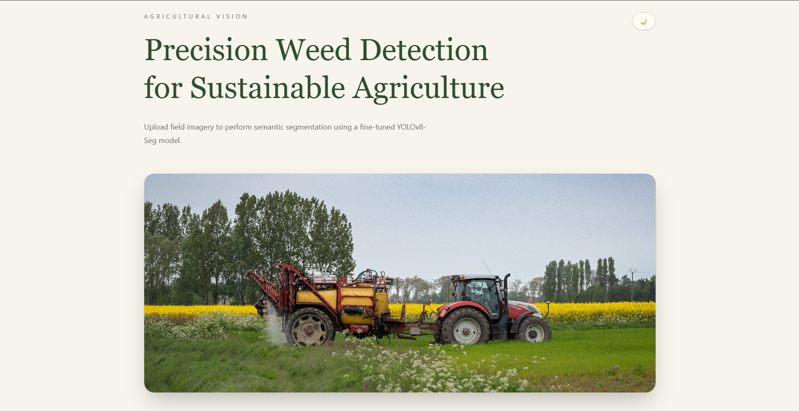

# 🌱 Precision Weed Detection System

A full-stack web application for automatic weed detection and semantic segmentation using a custom-trained **YOLOv8-Seg** model. Users can upload field images, detect weeds, visualize segmentation masks, and view species-specific information through a modern web interface.

---

## 🌐 Live Demo

**Frontend:** https://weed-detection-app.vercel.app/

---

## 📸 Preview



---

## ✨ Features

- Upload crop field images for analysis
- Automatic weed detection and semantic segmentation
- Weed species classification
- Confidence score and estimated weed count
- Interactive prediction summary
- Species-specific information panel
- Modern responsive React interface
- Optimized ONNX Runtime inference for lightweight cloud deployment

---

## 🏗️ Tech Stack

### Backend

- FastAPI
- ONNX Runtime
- OpenCV
- NumPy

### Frontend

- React
- Vite
- Tailwind CSS
- Framer Motion
- Nginx

### Model

- YOLOv8-Seg
- DeepWeeds Dataset
- Exported to ONNX for efficient inference

### Deployment
- Docker
- Docker Compose
- Vercel
- Nginx

---

## 📂 Project Structure

```text
weed_detection_app/
├── backend/
│   ├── app/
│   ├── models/
│   │   └── best.onnx
│   ├── Dockerfile
│   ├── Dockerfile.vercel
│   └── requirements.txt
│
├── frontend/
│   ├── src/
│   ├── public/
│   ├── Dockerfile
│   ├── Dockerfile.vercel
│   ├── nginx.conf
│   └── package.json
│
├── docker-compose.yml
├── vercel.json
└── README.md
```

---

## 🚀 Installation

### Clone the repository

```bash
git clone <repository-url>
cd weed_detection_app
```

### Backend

```bash
cd backend

pip install -r requirements.txt

uvicorn app.main:app --reload
```

### Frontend

```bash
cd frontend

npm install

npm run dev
```

---

## 🧠 Model

The application uses a custom-trained **YOLOv8-Seg** model trained on the **DeepWeeds** dataset for semantic weed segmentation.

To reduce memory consumption during deployment, the trained PyTorch model (`best.pt`) is exported to the ONNX format (`best.onnx`) and executed using **ONNX Runtime** instead of PyTorch.

The backend performs:

- Image preprocessing
- Letterbox resizing
- Image normalization
- ONNX Runtime inference
- Confidence filtering
- Non-Maximum Suppression (NMS)
- Segmentation mask decoding
- Visualization rendering
- JSON response generation

This optimization enables deployment on memory-constrained cloud platforms while maintaining accurate segmentation performance.

---

## 🔄 Inference Pipeline

```text
User Upload
      │
      ▼
FastAPI Backend
      │
      ▼
Image Preprocessing
      │
      ▼
ONNX Runtime Inference
      │
      ▼
Post-processing
      │
      ▼
Segmentation Visualization
      │
      ▼
Prediction Summary
      │
      ▼
React Frontend
```

---

## 📡 API

| Endpoint | Description |
|----------|-------------|
| `GET /api/` | Welcome endpoint |
| `GET /api/health` | Health check |
| `POST /api/predict` | Upload an image and receive segmentation results |

---

## 🚀 Deployment

- **Frontend:** Vercel
- **Backend:** Render
- **Inference Engine:** ONNX Runtime

The application is containerized using Docker with separate frontend and backend containers.

- The frontend is built using React + Vite and served using Nginx.
- The backend uses FastAPI with ONNX Runtime for model inference.
- The trained YOLOv8-Seg model is exported to ONNX format as `best.onnx`.
- Docker Compose is used for local container orchestration.
- The containerized frontend and backend are deployed on Vercel.

---

## 🎯 Future Improvements

- Grad-CAM visualizations
- Batch image inference
- Mobile-friendly interface
- Performance benchmarking

---

## 📄 License

This project was developed for academic and research purposes.
